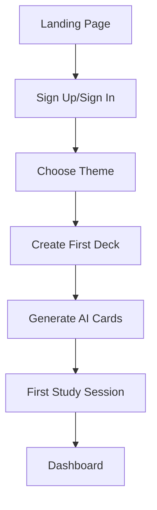
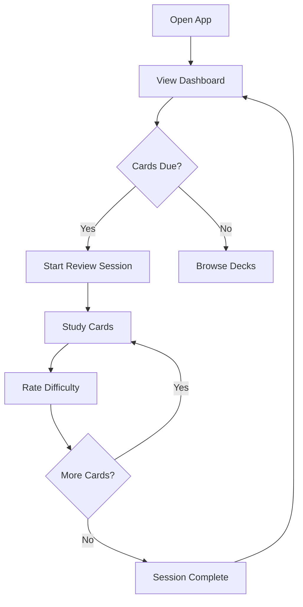
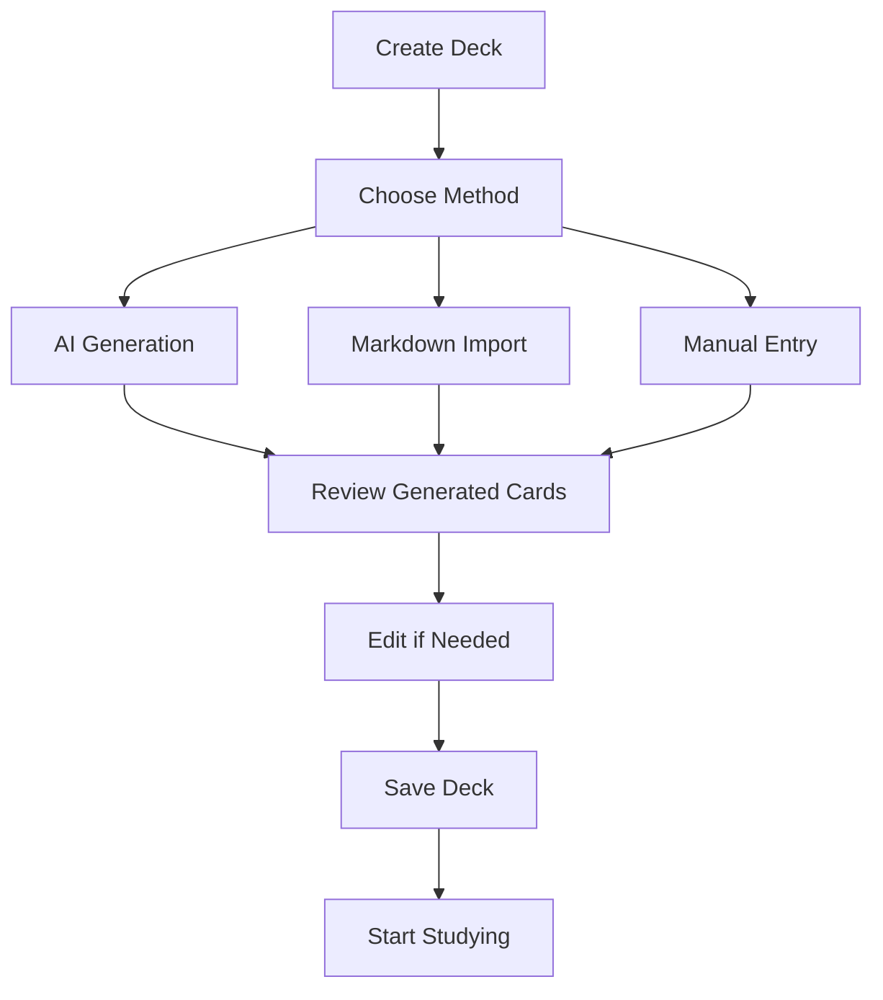

# Product Requirements Document (PRD)

## Anzii: AI-Powered Spaced Repetition Learning Platform

---

**Document Version:** 1.0  
**Last Updated:** January 2025  
**Project Status:** Core Platform Launched (Q1 2025)  
**Next Phase:** Advanced Features & Mobile Apps (Q2 2025)

---

## 📋 Executive Summary

### Product Vision

Anzii is a next-generation learning platform that revolutionizes how people acquire and retain knowledge by combining artificial intelligence with scientifically-proven spaced repetition algorithms. Our mission is to make learning more efficient, personalized, and accessible to everyone.

### Business Opportunity

- **Market Size**: $366B global education technology market
- **Target Segment**: 50M+ students and professionals seeking efficient learning solutions
- **Key Differentiator**: AI-powered content generation with optimized spaced repetition
- **Revenue Model**: Freemium SaaS with Basic (free) and Pro ($9.99/month) tiers

### Success Metrics

- **User Acquisition**: 100K active users by Q4 2025
- **Engagement**: 89% retention rate with 4.9/5 user satisfaction
- **Performance**: 2M+ AI-generated flashcards processed
- **Revenue**: $50K MRR by end of 2025

---

## 🎯 Product Overview

### Core Value Proposition

**"Transform any content into personalized flashcards using AI, then master it with scientifically-optimized spaced repetition."**

### Primary Goals

1. **Efficiency**: Reduce study time by 60% while improving retention
2. **Intelligence**: Leverage AI to create optimal learning experiences
3. **Accessibility**: Make advanced learning tools available to everyone
4. **Scalability**: Support diverse learning needs across domains

### Product Positioning

- **Direct Competitors**: Anki, Quizlet, Brainscape
- **Competitive Advantage**: AI-powered content generation + advanced SM-2 algorithm
- **Category**: AI-Enhanced Educational Technology

---

## 👥 Target Users & Market Analysis

### Primary User Personas

#### 1. **Sarah Chen** - Medical Student

- **Demographics**: 22-28 years old, pursuing medical degree
- **Pain Points**: Overwhelming volume of medical terminology and concepts
- **Goals**: Memorize complex information efficiently for board exams
- **Usage**: Creates decks from textbook PDFs, studies 30-45 min daily
- **Success Criteria**: Improved exam scores, reduced study stress

#### 2. **Marcus Rodriguez** - Software Engineer & Language Learner

- **Demographics**: 25-35 years old, tech professional learning new languages
- **Pain Points**: Limited time for language study, inefficient traditional methods
- **Goals**: Master 2000+ vocabulary words for career advancement
- **Usage**: AI-generated decks from language content, mobile studying during commute
- **Success Criteria**: Professional language certification achievement

#### 3. **Dr. Emily Watson** - University Professor

- **Demographics**: 35-50 years old, academic professional
- **Pain Points**: Need for detailed learning analytics and progress tracking
- **Goals**: Optimize teaching methods and personal knowledge retention
- **Usage**: Analyzes learning patterns, creates course-related study materials
- **Success Criteria**: Data-driven insights into learning effectiveness

### Market Segmentation

- **Students (40%)**: K-12, university, graduate students
- **Professionals (35%)**: Career development, certification preparation
- **Language Learners (15%)**: Vocabulary acquisition, cultural learning
- **Lifelong Learners (10%)**: Personal interest, hobby learning

---

## 🔧 Core Features & Requirements

### Phase 1: Foundation (✅ COMPLETED - Q1 2025)

#### 1.1 AI-Powered Content Generation

**Priority: P0 (Critical)**

- **Requirement**: Generate flashcards from any text input using Google Gemini API
- **Acceptance Criteria**:
  - Process text, PDFs, and markdown content
  - Generate contextually relevant question-answer pairs
  - Achieve 95%+ accuracy in content interpretation
  - Support 10+ languages with proper context understanding
- **Technical Specs**:
  - Gemini Pro API integration
  - Content preprocessing pipeline
  - Error handling for malformed content

#### 1.2 Spaced Repetition System (SM-2 Algorithm)

**Priority: P0 (Critical)**

- **Requirement**: Implement scientifically-proven spaced repetition for optimal learning
- **Acceptance Criteria**:
  - SM-2 algorithm with ease factor adjustments
  - Performance-based interval calculations
  - Due date scheduling system
  - Rating system (1-5 scale: Again, Hard, Medium, Good, Easy)
- **Technical Specs**:
  ```typescript
  interface SpacedRepetitionCard {
  	id: string;
  	interval: number; // Days until next review
  	easeFactor: number; // Learning difficulty (1.3-2.5)
  	dueDate: Date; // When card should be reviewed
  	lastReviewed: Date; // Previous review timestamp
  }
  ```

#### 1.3 Deck Management System

**Priority: P0 (Critical)**

- **Requirement**: Create, organize, and manage flashcard collections
- **Acceptance Criteria**:
  - CRUD operations for decks and cards
  - Deck metadata (name, description, card count, progress)
  - Card editor with markdown support
  - Deck reset and progress tracking
- **Technical Specs**: PostgreSQL database with Drizzle ORM

#### 1.4 User Authentication & Settings

**Priority: P0 (Critical)**

- **Requirement**: Secure user accounts with customizable preferences
- **Acceptance Criteria**:
  - Stack Auth integration for OAuth providers
  - Profile management (display name, email)
  - Theme selection (17 curated themes)
  - Account security and data privacy controls
- **Technical Specs**: Stack Auth with Next.js App Router

### Phase 2: Enhanced Experience (🔄 IN PROGRESS - Q2 2025)

#### 2.1 Advanced Analytics Dashboard

**Priority: P1 (High)**

- **Requirement**: Comprehensive learning insights and progress visualization
- **Acceptance Criteria**:
  - Learning streak tracking and gamification
  - Retention rate analysis with visual charts
  - Performance heat maps by topic/deck
  - Predictive analytics for review optimization
  - Weekly/monthly progress reports
- **User Stories**:
  - As a user, I want to see my learning streaks to stay motivated
  - As a student, I need retention analytics to identify weak areas
  - As a professional, I want progress reports for performance reviews

#### 2.2 Mobile Applications (iOS & Android)

**Priority: P1 (High)**

- **Requirement**: Native mobile apps with offline capabilities
- **Acceptance Criteria**:
  - React Native or Flutter implementation
  - Offline study mode with sync when online
  - Push notifications for due reviews
  - Native performance for smooth animations
  - App Store and Google Play distribution
- **Technical Specs**:
  - Cross-platform framework selection
  - Local SQLite database for offline storage
  - Background sync with conflict resolution

#### 2.3 Collaborative Study Features

**Priority: P2 (Medium)**

- **Requirement**: Social learning and deck sharing capabilities
- **Acceptance Criteria**:
  - Share decks with specific users or publicly
  - Collaborative deck editing with version control
  - Study group creation and management
  - Leaderboards and group challenges
  - Comments and feedback on shared decks

### Phase 3: Advanced Intelligence (📅 PLANNED - Q3 2025)

#### 3.1 AI Study Assistant

**Priority: P1 (High)**

- **Requirement**: Personalized AI coaching and study recommendations
- **Acceptance Criteria**:
  - Analyze learning patterns and suggest optimal study times
  - Identify knowledge gaps and recommend focused review
  - Generate personalized study plans based on goals
  - Voice interaction for hands-free studying
  - Integration with calendar applications

#### 3.2 Enhanced Security & Privacy

**Priority: P0 (Critical)**

- **Requirement**: Advanced data protection and privacy controls
- **Acceptance Criteria**:
  - End-to-end encryption for sensitive study materials
  - GDPR/CCPA compliance with data export/deletion
  - Advanced authentication (2FA, biometric)
  - Audit logs for data access and modifications
  - Privacy-first AI processing options

### Phase 4: Scale & Monetization (📅 PLANNED - Q4 2025)

#### 4.1 Global Marketplace

**Priority: P2 (Medium)**

- **Requirement**: Community-driven content marketplace
- **Acceptance Criteria**:
  - Curated deck marketplace with quality ratings
  - Deck monetization for content creators
  - Advanced search and discovery algorithms
  - Quality assurance and content moderation
  - Revenue sharing with creators

#### 4.2 Enterprise Solutions

**Priority: P1 (High)**

- **Requirement**: Team management and institutional features
- **Acceptance Criteria**:
  - Organization accounts with user management
  - SSO integration for enterprise authentication
  - Compliance features for educational institutions
  - Advanced analytics for team performance
  - Custom branding and white-label options

---

## 🎨 User Experience Requirements

### Design Principles

1. **Minimalist Interface**: Clean, distraction-free learning environment
2. **Instant Feedback**: Zero-latency responses during study sessions
3. **Progressive Disclosure**: Show complexity only when needed
4. **Accessibility First**: WCAG 2.1 AA compliance for inclusive design
5. **Mobile-First**: Optimized for mobile usage patterns

### Core User Flows

#### 1. Onboarding Flow



#### 2. Daily Study Flow



#### 3. Content Creation Flow



### Interface Requirements

#### Dashboard

- **Layout**: Grid-based deck display with progress indicators
- **Navigation**: Persistent header with theme toggle and user menu
- **Actions**: Quick access to create, study, and manage decks
- **Feedback**: Loading states, success/error notifications

#### Study Session

- **Card Display**: Large, readable question/answer format
- **Rating System**: 5-button difficulty scale (Again, Hard, Medium, Good, Easy)
- **Progress**: Visual indicator of session progress and remaining cards
- **Performance**: Optimistic UI updates for instant feedback

#### Content Creation

- **AI Generation**: Simple topic input with preview of generated cards
- **Markdown Support**: Rich text editor with live preview
- **Bulk Import**: Drag-and-drop file upload with format validation
- **Card Editor**: Individual card editing with undo/redo functionality

---

## ⚙️ Technical Requirements

### Architecture Overview

```mermaid
graph TB
    subgraph "Frontend Layer"
        A[Next.js 14 App Router]
        B[React 18 Components]
        C[Tailwind CSS + shadcn/ui]
        D[TypeScript]
    end

    subgraph "Backend Layer"
        E[Next.js Server Actions]
        F[Authentication (Stack Auth)]
        G[Database (PostgreSQL + Drizzle)]
    end

    subgraph "External Services"
        H[Google Gemini AI]
        I[Vercel Deployment]
        J[Neon Database]
    end

    A --> E
    B --> E
    E --> F
    E --> G
    E --> H
    G --> J
    A --> I
```

### Technology Stack

#### Frontend

- **Framework**: Next.js 14 with App Router
- **UI Library**: React 18 with TypeScript
- **Styling**: Tailwind CSS with shadcn/ui components
- **State Management**: React hooks with custom state management
- **Animations**: CSS transforms with GPU acceleration
- **Theme System**: next-themes with 17 curated themes

#### Backend

- **Runtime**: Node.js with Next.js API routes and Server Actions
- **Database**: PostgreSQL with Drizzle ORM
- **Authentication**: Stack Auth with OAuth providers
- **AI Integration**: Google Gemini Pro API
- **File Storage**: Vercel Blob for file uploads

#### Infrastructure

- **Hosting**: Vercel with edge functions
- **Database**: Neon PostgreSQL with connection pooling
- **CDN**: Vercel Edge Network for global performance
- **Monitoring**: Vercel Analytics and error tracking

### Performance Requirements

#### Core Metrics

- **First Contentful Paint**: < 1.5s
- **Largest Contentful Paint**: < 2.5s
- **Cumulative Layout Shift**: < 0.1
- **First Input Delay**: < 100ms
- **Time to Interactive**: < 3s

#### Scalability Targets

- **Concurrent Users**: 10,000+ simultaneous active users
- **API Response Time**: < 200ms for 95th percentile
- **Database Queries**: < 100ms average response time
- **AI Generation**: < 5s for deck creation from content
- **Uptime**: 99.9% availability with < 1 hour downtime/month

#### Optimization Strategies

- **Code Splitting**: Route-based and component-based lazy loading
- **Image Optimization**: Next.js Image component with WebP support
- **Caching**: Redis for session data and frequent queries
- **CDN**: Static asset delivery through global edge network
- **Database**: Query optimization and connection pooling

---

## 📊 Success Metrics & KPIs

### Primary Success Metrics

#### User Acquisition & Growth

- **Monthly Active Users (MAU)**: Target 100K by Q4 2025
- **Weekly Active Users (WAU)**: 70% of MAU (weekly engagement)
- **Daily Active Users (DAU)**: 30% of MAU (daily usage)
- **User Growth Rate**: 15% month-over-month growth
- **Organic vs. Paid Acquisition**: 60% organic, 40% paid marketing

#### User Engagement & Retention

- **Day 1 Retention**: 80% of new users return within 24 hours
- **Day 7 Retention**: 60% of users active after first week
- **Day 30 Retention**: 40% of users active after first month
- **Session Duration**: Average 15+ minutes per study session
- **Study Streak**: 70% of users maintain 7+ day streaks

#### Learning Effectiveness

- **Knowledge Retention**: 89% retention rate (vs. 67% traditional methods)
- **Study Time Reduction**: 60% less time needed for same learning outcomes
- **User Satisfaction**: 4.9/5 average rating with 95% recommendation rate
- **Learning Goals Achievement**: 85% of users achieve defined learning objectives
- **Performance Improvement**: 40% increase in test scores vs. control group

### Business Metrics

#### Revenue & Monetization

- **Monthly Recurring Revenue (MRR)**: $50K by Q4 2025
- **Annual Recurring Revenue (ARR)**: $600K by end of 2025
- **Customer Acquisition Cost (CAC)**: < $15 per user
- **Lifetime Value (LTV)**: > $180 per user (12x LTV:CAC ratio)
- **Conversion Rate**: 8% free-to-paid conversion within 30 days

#### Product Performance

- **AI Generation Accuracy**: 95%+ correct question-answer pairs
- **API Uptime**: 99.9% availability with < 200ms response time
- **Deck Creation Time**: < 5 minutes from content to study-ready deck
- **Cross-Platform Sync**: < 1 second synchronization delay
- **Content Processing**: Support 50+ file formats with 99% success rate

### Operational Metrics

#### Development & Quality

- **Feature Velocity**: 2 major features per quarter
- **Bug Resolution**: 95% of bugs resolved within 48 hours
- **Code Coverage**: 90%+ test coverage for critical paths
- **Performance Budget**: Maintain Core Web Vitals thresholds
- **Security**: Zero critical security vulnerabilities

#### Customer Success

- **Support Response Time**: < 2 hours for first response
- **Issue Resolution**: 90% of issues resolved within 24 hours
- **Customer Satisfaction**: 95%+ satisfaction with support interactions
- **Feature Adoption**: 70% of users adopt new features within 30 days
- **Churn Rate**: < 5% monthly churn rate for paid users

---

## 🗓️ Development Timeline & Milestones

### Q1 2025 - Foundation Launch ✅ COMPLETED

#### ✅ **Milestone 1.1**: Core Platform MVP

- **Deliverables**: Basic flashcard system, spaced repetition algorithm
- **Completion**: January 2025
- **Success Criteria**: Functional study sessions with SM-2 implementation

#### ✅ **Milestone 1.2**: AI Integration

- **Deliverables**: Google Gemini API integration, content generation
- **Completion**: February 2025
- **Success Criteria**: 95% accuracy in flashcard generation from text

#### ✅ **Milestone 1.3**: User Experience Polish

- **Deliverables**: Theme system, responsive design, authentication
- **Completion**: March 2025
- **Success Criteria**: 4.5+ user satisfaction rating, mobile optimization

### Q2 2025 - Enhanced Features 🔄 IN PROGRESS

#### 📅 **Milestone 2.1**: Advanced Analytics (April 2025)

- **Deliverables**: Progress tracking, retention analytics, performance insights
- **Success Criteria**: User engagement increase by 25%
- **Dependencies**: Database schema updates, visualization components

#### 📅 **Milestone 2.2**: Mobile Applications (May 2025)

- **Deliverables**: iOS and Android apps with offline capabilities
- **Success Criteria**: App store approval, 4.5+ rating, 50% mobile usage
- **Dependencies**: React Native setup, offline sync architecture

#### 📅 **Milestone 2.3**: Social Features (June 2025)

- **Deliverables**: Deck sharing, study groups, collaborative features
- **Success Criteria**: 30% of users engage with social features
- **Dependencies**: User permissions system, real-time updates

### Q3 2025 - AI Enhancement 📅 PLANNED

#### 📅 **Milestone 3.1**: AI Study Assistant (July 2025)

- **Deliverables**: Personalized recommendations, study optimization
- **Success Criteria**: 20% improvement in learning outcomes
- **Dependencies**: Machine learning pipeline, user behavior analysis

#### 📅 **Milestone 3.2**: Advanced Security (August 2025)

- **Deliverables**: End-to-end encryption, compliance features
- **Success Criteria**: SOC 2 Type II certification, GDPR compliance
- **Dependencies**: Security audit, compliance documentation

#### 📅 **Milestone 3.3**: Performance Optimization (September 2025)

- **Deliverables**: Enhanced performance, scalability improvements
- **Success Criteria**: Support 50K+ concurrent users, < 100ms API response
- **Dependencies**: Infrastructure scaling, database optimization

### Q4 2025 - Scale & Monetization 📅 PLANNED

#### 📅 **Milestone 4.1**: Marketplace Launch (October 2025)

- **Deliverables**: Community content, creator monetization
- **Success Criteria**: 1000+ quality decks, $10K creator revenue
- **Dependencies**: Content moderation system, payment processing

#### 📅 **Milestone 4.2**: Enterprise Features (November 2025)

- **Deliverables**: Team management, SSO, analytics dashboard
- **Success Criteria**: 5+ enterprise customers, $20K+ enterprise revenue
- **Dependencies**: Multi-tenant architecture, compliance features

#### 📅 **Milestone 4.3**: Global Expansion (December 2025)

- **Deliverables**: Internationalization, localized content
- **Success Criteria**: Support 10+ languages, 30% international users
- **Dependencies**: Translation pipeline, regional infrastructure

---

## 🚨 Risk Assessment & Mitigation

### Technical Risks

#### **High Risk**: AI API Rate Limiting

- **Impact**: Service disruption during peak usage
- **Probability**: Medium (30%)
- **Mitigation**:
  - Implement request queuing and batching
  - Multiple AI provider fallbacks (OpenAI, Anthropic)
  - Local caching of generated content
  - Rate limiting dashboard for monitoring

#### **Medium Risk**: Database Performance at Scale

- **Impact**: Slow response times affecting user experience
- **Probability**: Medium (40%)
- **Mitigation**:
  - Database connection pooling and read replicas
  - Query optimization and indexing strategy
  - Implement Redis caching layer
  - Regular performance monitoring and alerts

#### **Low Risk**: Third-Party Service Dependencies

- **Impact**: Feature degradation if services are unavailable
- **Probability**: Low (15%)
- **Mitigation**:
  - Circuit breaker patterns for external APIs
  - Graceful degradation of non-critical features
  - Service level agreements with providers
  - Regular uptime monitoring and alerts

### Business Risks

#### **High Risk**: Competitive Market Entry

- **Impact**: Loss of market share to well-funded competitors
- **Probability**: High (60%)
- **Mitigation**:
  - Focus on AI differentiation and user experience
  - Build strong user community and network effects
  - Rapid feature development and innovation cycles
  - Strategic partnerships with educational institutions

#### **Medium Risk**: User Acquisition Costs

- **Impact**: Unsustainable unit economics and funding requirements
- **Probability**: Medium (35%)
- **Mitigation**:
  - Optimize conversion funnel and onboarding experience
  - Implement referral programs and viral features
  - Content marketing and SEO strategy
  - Partnership with educational content creators

#### **Low Risk**: Regulatory Changes

- **Impact**: Need for compliance updates affecting development velocity
- **Probability**: Low (20%)
- **Mitigation**:
  - Proactive compliance with education and privacy regulations
  - Legal review of data handling practices
  - Regular compliance audits and updates
  - Flexible architecture for regulatory adaptations

### Operational Risks

#### **Medium Risk**: Team Scaling Challenges

- **Impact**: Development velocity reduction and quality issues
- **Probability**: Medium (40%)
- **Mitigation**:
  - Structured hiring process with technical assessments
  - Comprehensive onboarding and documentation
  - Code review processes and quality standards
  - Regular team training and skill development

#### **Low Risk**: Data Security Breaches

- **Impact**: User trust loss and potential legal liabilities
- **Probability**: Low (10%)
- **Mitigation**:
  - Regular security audits and penetration testing
  - Employee security training and access controls
  - Incident response plan and communication strategy
  - Cyber insurance and legal compliance review

---

## 💰 Business Model & Monetization

### Revenue Streams

#### 1. **Freemium Subscription Model** (Primary)

- **Basic Plan**: Free with limitations
  - 50 AI flashcards per month
  - Basic spaced repetition
  - Text import only
  - Web access
  - Community support
- **Pro Plan**: $9.99/month or $99/year
  - Unlimited AI flashcard generation
  - Advanced spaced repetition with detailed analytics
  - Multi-format import (PDFs, images, audio)
  - Mobile app access with offline sync
  - Priority support
  - Advanced themes and customization

#### 2. **Enterprise Solutions** (Secondary)

- **Team Plan**: $19.99/month per user (minimum 5 users)
  - All Pro features
  - Team management and analytics
  - SSO integration
  - Custom branding
  - Dedicated support

- **Institution Plan**: Custom pricing
  - All Team features
  - SCORM/LTI integration
  - Advanced compliance features
  - On-premise deployment options
  - Professional services and training

#### 3. **Marketplace Revenue** (Future)

- **Creator Economy**: 30% revenue share on premium deck sales
- **Affiliate Commissions**: 10% commission on educational content partnerships
- **Certification Programs**: $99-299 for verified learning credentials

### Pricing Strategy

#### Market Positioning

- **Premium Positioning**: Price above basic competitors (Quizlet: $7.99/month)
- **Value Justification**: AI-powered features and proven learning outcomes
- **Competitive Advantage**: Unique AI content generation and advanced analytics

#### Pricing Psychology

- **Annual Discount**: 17% savings to encourage yearly commitments
- **Free Trial**: 14-day Pro trial to demonstrate premium value
- **Usage-Based Limits**: Clear progression from free to paid features
- **Grandfather Pricing**: Early adopters receive permanent discounts

### Customer Acquisition Strategy

#### Organic Growth

- **Content Marketing**: Educational blog posts about learning science
- **SEO Optimization**: Target keywords related to flashcards and spaced repetition
- **Social Proof**: User testimonials and case studies
- **Referral Program**: 1 month free for successful referrals

#### Paid Acquisition

- **Educational Platforms**: Targeted ads on Khan Academy, Coursera
- **Social Media**: Instagram and TikTok ads for student demographics
- **Google Ads**: Search campaigns for learning-related keywords
- **Influencer Partnerships**: Collaborations with educational content creators

#### Partnership Channels

- **Educational Institutions**: University bookstore partnerships
- **Professional Organizations**: Certification body collaborations
- **Content Creators**: Revenue sharing with course creators
- **Study Groups**: Integration with existing learning communities

---

## 🔄 Feedback & Iteration Strategy

### User Research & Validation

#### Continuous Feedback Collection

- **In-App Surveys**: NPS scores and feature feedback after key interactions
- **User Interviews**: Monthly interviews with 20+ active users across segments
- **Usage Analytics**: Detailed tracking of user behavior and feature adoption
- **A/B Testing**: Continuous experimentation on core user flows

#### Research Methodologies

- **Usability Testing**: Weekly sessions with 5-8 users on new features
- **Card Sorting**: Information architecture validation for complex features
- **Journey Mapping**: Quarterly reviews of end-to-end user experiences
- **Competitive Analysis**: Monthly monitoring of competitor feature releases

### Product Development Process

#### Agile Development Framework

- **Sprint Planning**: 2-week sprints with clear deliverables and acceptance criteria
- **Daily Standups**: Progress tracking and blocker identification
- **Sprint Reviews**: Stakeholder demos and feedback collection
- **Retrospectives**: Team process improvements and lessons learned

#### Feature Prioritization Framework

1. **Impact vs. Effort Matrix**: Evaluate features on user impact and development complexity
2. **User Feedback Weight**: Prioritize features based on user request frequency and urgency
3. **Business Value Assessment**: Align features with revenue goals and strategic objectives
4. **Technical Debt Balance**: Maintain 70% new features, 30% technical improvements

### Quality Assurance & Testing

#### Automated Testing Strategy

- **Unit Tests**: 90%+ coverage for core business logic and algorithms
- **Integration Tests**: API endpoints and database interactions
- **End-to-End Tests**: Critical user paths automated with Playwright
- **Performance Tests**: Load testing with realistic user scenarios

#### Manual Testing Process

- **Feature Testing**: Comprehensive testing of new features before release
- **Regression Testing**: Verification that existing functionality remains intact
- **Cross-Platform Testing**: iOS, Android, and web compatibility validation
- **Accessibility Testing**: WCAG 2.1 AA compliance verification

### Release Management

#### Release Cadence

- **Major Releases**: Quarterly feature releases with comprehensive testing
- **Minor Releases**: Monthly bug fixes and small feature improvements
- **Hotfixes**: Critical bug fixes deployed within 24 hours
- **Feature Flags**: Gradual rollouts with ability to disable problematic features

#### Release Process

1. **Development**: Feature development in isolated branches
2. **Code Review**: Peer review for all code changes
3. **Staging Deployment**: Full testing in production-like environment
4. **Gradual Rollout**: 5% → 25% → 50% → 100% user rollout
5. **Monitoring**: Real-time monitoring of key metrics and error rates
6. **Rollback Plan**: Immediate rollback capability for critical issues

---

## 📞 Stakeholders & Communication

### Internal Stakeholders

#### **Product Team**

- **Product Manager**: Overall product strategy and roadmap ownership
- **Lead Designer**: User experience design and research coordination
- **Engineering Lead**: Technical architecture and development oversight
- **Data Analyst**: Metrics tracking and user behavior analysis

#### **Business Team**

- **CEO/Founder**: Vision alignment and strategic decision making
- **Marketing Manager**: User acquisition and brand positioning
- **Customer Success**: User onboarding and support optimization
- **Operations**: Infrastructure and scaling planning

### External Stakeholders

#### **Users**

- **Primary Users**: Students, professionals, and lifelong learners
- **Power Users**: Heavy users providing detailed feedback and feature requests
- **Beta Testers**: Early adopters testing new features before public release
- **Community Champions**: Active users promoting the product and helping others

#### **Partners**

- **Educational Institutions**: Universities and schools using the platform
- **Content Creators**: Educators and experts creating premium content
- **Technology Partners**: AI providers, cloud infrastructure, and tool integrations
- **Investors**: Funding partners interested in growth metrics and strategic direction

### Communication Framework

#### **Regular Reporting**

- **Weekly Stakeholder Updates**: Progress on key metrics and milestones
- **Monthly Product Reviews**: Feature development status and user feedback
- **Quarterly Business Reviews**: Financial performance and strategic adjustments
- **Annual Planning Sessions**: Long-term vision and roadmap planning

#### **Communication Channels**

- **Slack**: Daily team communication and quick updates
- **Email**: Formal stakeholder reports and external communications
- **Video Calls**: User interviews, team meetings, and stakeholder presentations
- **Documentation**: Shared knowledge base for product specifications and decisions

#### **Decision Making Process**

1. **Data Collection**: Gather user feedback, usage analytics, and competitive intelligence
2. **Stakeholder Input**: Collect perspectives from relevant internal and external stakeholders
3. **Impact Assessment**: Evaluate potential outcomes and resource requirements
4. **Decision Documentation**: Record rationale and expected outcomes
5. **Communication**: Share decisions with all affected stakeholders
6. **Review & Iteration**: Monitor results and adjust based on outcomes

---

## 📋 Conclusion

Anzii represents a significant opportunity to revolutionize digital learning through the intelligent combination of artificial intelligence and scientifically-proven learning methodologies. By focusing on user-centric design, technological excellence, and measurable learning outcomes, we are positioned to capture a significant share of the growing educational technology market.

### Key Success Factors

1. **AI Differentiation**: Maintaining technological leadership in content generation
2. **User Experience**: Delivering intuitive, engaging learning experiences
3. **Learning Effectiveness**: Proving measurable improvements in knowledge retention
4. **Community Building**: Creating network effects through social features and content sharing
5. **Scalable Technology**: Building infrastructure that supports rapid growth

### Next Steps

1. **Immediate Focus**: Complete Q2 2025 milestones (analytics, mobile apps, social features)
2. **Resource Allocation**: Hire additional engineers and designers to support ambitious roadmap
3. **Market Validation**: Expand user research to validate enterprise and marketplace opportunities
4. **Partnership Development**: Establish relationships with educational institutions and content creators
5. **Funding Strategy**: Prepare for Series A funding to accelerate growth and market expansion

This PRD serves as a living document that will evolve as we gather more user feedback, market intelligence, and technical learnings. Regular reviews and updates will ensure alignment between product development and business objectives while maintaining focus on our core mission of making learning more effective and accessible for everyone.

---

**Document Owner**: Product Team  
**Review Cycle**: Monthly  
**Next Review**: February 2025  
**Distribution**: All stakeholders, development team, investors

`````

**Output:**
<!-- prettier-ignore -->
````markdown
# Product Requirements Document (PRD)

## Anzii: AI-Powered Spaced Repetition Learning Platform

---

**Document Version:** 1.0
**Last Updated:** January 2025
**Project Status:** Core Platform Launched (Q1 2025)
**Next Phase:** Advanced Features & Mobile Apps (Q2 2025)

---

## 📋 Executive Summary

### Product Vision

Anzii is a next-generation learning platform that revolutionizes how people
acquire and retain knowledge by combining artificial intelligence with
scientifically-proven spaced repetition algorithms. Our mission is to make
learning more efficient, personalized, and accessible to everyone.

### Business Opportunity

- **Market Size**: $366B global education technology market
- **Target Segment**: 50M+ students and professionals seeking efficient learning
  solutions
- **Key Differentiator**: AI-powered content generation with optimized spaced
  repetition
- **Revenue Model**: Freemium SaaS with Basic (free) and Pro ($9.99/month) tiers

### Success Metrics

- **User Acquisition**: 100K active users by Q4 2025
- **Engagement**: 89% retention rate with 4.9/5 user satisfaction
- **Performance**: 2M+ AI-generated flashcards processed
- **Revenue**: $50K MRR by end of 2025

---

## 🎯 Product Overview

### Core Value Proposition

**"Transform any content into personalized flashcards using AI, then master it
with scientifically-optimized spaced repetition."**

### Primary Goals

1. **Efficiency**: Reduce study time by 60% while improving retention
2. **Intelligence**: Leverage AI to create optimal learning experiences
3. **Accessibility**: Make advanced learning tools available to everyone
4. **Scalability**: Support diverse learning needs across domains

### Product Positioning

- **Direct Competitors**: Anki, Quizlet, Brainscape
- **Competitive Advantage**: AI-powered content generation + advanced SM-2
  algorithm
- **Category**: AI-Enhanced Educational Technology

---

## 👥 Target Users & Market Analysis

### Primary User Personas

#### 1. **Sarah Chen** - Medical Student

- **Demographics**: 22-28 years old, pursuing medical degree
- **Pain Points**: Overwhelming volume of medical terminology and concepts
- **Goals**: Memorize complex information efficiently for board exams
- **Usage**: Creates decks from textbook PDFs, studies 30-45 min daily
- **Success Criteria**: Improved exam scores, reduced study stress

#### 2. **Marcus Rodriguez** - Software Engineer & Language Learner

- **Demographics**: 25-35 years old, tech professional learning new languages
- **Pain Points**: Limited time for language study, inefficient traditional
  methods
- **Goals**: Master 2000+ vocabulary words for career advancement
- **Usage**: AI-generated decks from language content, mobile studying during
  commute
- **Success Criteria**: Professional language certification achievement

#### 3. **Dr. Emily Watson** - University Professor

- **Demographics**: 35-50 years old, academic professional
- **Pain Points**: Need for detailed learning analytics and progress tracking
- **Goals**: Optimize teaching methods and personal knowledge retention
- **Usage**: Analyzes learning patterns, creates course-related study materials
- **Success Criteria**: Data-driven insights into learning effectiveness

### Market Segmentation

- **Students (40%)**: K-12, university, graduate students
- **Professionals (35%)**: Career development, certification preparation
- **Language Learners (15%)**: Vocabulary acquisition, cultural learning
- **Lifelong Learners (10%)**: Personal interest, hobby learning

---

## 🔧 Core Features & Requirements

### Phase 1: Foundation (✅ COMPLETED - Q1 2025)

#### 1.1 AI-Powered Content Generation

**Priority: P0 (Critical)**

- **Requirement**: Generate flashcards from any text input using Google Gemini
  API
- **Acceptance Criteria**:
  - Process text, PDFs, and markdown content
  - Generate contextually relevant question-answer pairs
  - Achieve 95%+ accuracy in content interpretation
  - Support 10+ languages with proper context understanding
- **Technical Specs**:
  - Gemini Pro API integration
  - Content preprocessing pipeline
  - Error handling for malformed content

#### 1.2 Spaced Repetition System (SM-2 Algorithm)

**Priority: P0 (Critical)**

- **Requirement**: Implement scientifically-proven spaced repetition for optimal
  learning
- **Acceptance Criteria**:
  - SM-2 algorithm with ease factor adjustments
  - Performance-based interval calculations
  - Due date scheduling system
  - Rating system (1-5 scale: Again, Hard, Medium, Good, Easy)
- **Technical Specs**:
  ```typescript
  interface SpacedRepetitionCard {
    id: string;
    interval: number; // Days until next review
    easeFactor: number; // Learning difficulty (1.3-2.5)
    dueDate: Date; // When card should be reviewed
    lastReviewed: Date; // Previous review timestamp
  }
  ```

#### 1.3 Deck Management System

**Priority: P0 (Critical)**

- **Requirement**: Create, organize, and manage flashcard collections
- **Acceptance Criteria**:
  - CRUD operations for decks and cards
  - Deck metadata (name, description, card count, progress)
  - Card editor with markdown support
  - Deck reset and progress tracking
- **Technical Specs**: PostgreSQL database with Drizzle ORM

#### 1.4 User Authentication & Settings

**Priority: P0 (Critical)**

- **Requirement**: Secure user accounts with customizable preferences
- **Acceptance Criteria**:
  - Stack Auth integration for OAuth providers
  - Profile management (display name, email)
  - Theme selection (17 curated themes)
  - Account security and data privacy controls
- **Technical Specs**: Stack Auth with Next.js App Router

### Phase 2: Enhanced Experience (🔄 IN PROGRESS - Q2 2025)

#### 2.1 Advanced Analytics Dashboard

**Priority: P1 (High)**

- **Requirement**: Comprehensive learning insights and progress visualization
- **Acceptance Criteria**:
  - Learning streak tracking and gamification
  - Retention rate analysis with visual charts
  - Performance heat maps by topic/deck
  - Predictive analytics for review optimization
  - Weekly/monthly progress reports
- **User Stories**:
  - As a user, I want to see my learning streaks to stay motivated
  - As a student, I need retention analytics to identify weak areas
  - As a professional, I want progress reports for performance reviews

#### 2.2 Mobile Applications (iOS & Android)

**Priority: P1 (High)**

- **Requirement**: Native mobile apps with offline capabilities
- **Acceptance Criteria**:
  - React Native or Flutter implementation
  - Offline study mode with sync when online
  - Push notifications for due reviews
  - Native performance for smooth animations
  - App Store and Google Play distribution
- **Technical Specs**:
  - Cross-platform framework selection
  - Local SQLite database for offline storage
  - Background sync with conflict resolution

#### 2.3 Collaborative Study Features

**Priority: P2 (Medium)**

- **Requirement**: Social learning and deck sharing capabilities
- **Acceptance Criteria**:
  - Share decks with specific users or publicly
  - Collaborative deck editing with version control
  - Study group creation and management
  - Leaderboards and group challenges
  - Comments and feedback on shared decks

### Phase 3: Advanced Intelligence (📅 PLANNED - Q3 2025)

#### 3.1 AI Study Assistant

**Priority: P1 (High)**

- **Requirement**: Personalized AI coaching and study recommendations
- **Acceptance Criteria**:
  - Analyze learning patterns and suggest optimal study times
  - Identify knowledge gaps and recommend focused review
  - Generate personalized study plans based on goals
  - Voice interaction for hands-free studying
  - Integration with calendar applications

#### 3.2 Enhanced Security & Privacy

**Priority: P0 (Critical)**

- **Requirement**: Advanced data protection and privacy controls
- **Acceptance Criteria**:
  - End-to-end encryption for sensitive study materials
  - GDPR/CCPA compliance with data export/deletion
  - Advanced authentication (2FA, biometric)
  - Audit logs for data access and modifications
  - Privacy-first AI processing options

### Phase 4: Scale & Monetization (📅 PLANNED - Q4 2025)

#### 4.1 Global Marketplace

**Priority: P2 (Medium)**

- **Requirement**: Community-driven content marketplace
- **Acceptance Criteria**:
  - Curated deck marketplace with quality ratings
  - Deck monetization for content creators
  - Advanced search and discovery algorithms
  - Quality assurance and content moderation
  - Revenue sharing with creators

#### 4.2 Enterprise Solutions

**Priority: P1 (High)**

- **Requirement**: Team management and institutional features
- **Acceptance Criteria**:
  - Organization accounts with user management
  - SSO integration for enterprise authentication
  - Compliance features for educational institutions
  - Advanced analytics for team performance
  - Custom branding and white-label options

---

## 🎨 User Experience Requirements

### Design Principles

1. **Minimalist Interface**: Clean, distraction-free learning environment
2. **Instant Feedback**: Zero-latency responses during study sessions
3. **Progressive Disclosure**: Show complexity only when needed
4. **Accessibility First**: WCAG 2.1 AA compliance for inclusive design
5. **Mobile-First**: Optimized for mobile usage patterns

### Core User Flows

#### 1. Onboarding Flow


#### 2. Daily Study Flow


#### 3. Content Creation Flow


### Interface Requirements

#### Dashboard

- **Layout**: Grid-based deck display with progress indicators
- **Navigation**: Persistent header with theme toggle and user menu
- **Actions**: Quick access to create, study, and manage decks
- **Feedback**: Loading states, success/error notifications

#### Study Session

- **Card Display**: Large, readable question/answer format
- **Rating System**: 5-button difficulty scale (Again, Hard, Medium, Good, Easy)
- **Progress**: Visual indicator of session progress and remaining cards
- **Performance**: Optimistic UI updates for instant feedback

#### Content Creation

- **AI Generation**: Simple topic input with preview of generated cards
- **Markdown Support**: Rich text editor with live preview
- **Bulk Import**: Drag-and-drop file upload with format validation
- **Card Editor**: Individual card editing with undo/redo functionality

---

## ⚙️ Technical Requirements

### Architecture Overview

```mermaid
graph TB
    subgraph "Frontend Layer"
        A[Next.js 14 App Router]
        B[React 18 Components]
        C[Tailwind CSS + shadcn/ui]
        D[TypeScript]
    end

    subgraph "Backend Layer"
        E[Next.js Server Actions]
        F[Authentication (Stack Auth)]
        G[Database (PostgreSQL + Drizzle)]
    end

    subgraph "External Services"
        H[Google Gemini AI]
        I[Vercel Deployment]
        J[Neon Database]
    end

    A --> E
    B --> E
    E --> F
    E --> G
    E --> H
    G --> J
    A --> I
```

### Technology Stack

#### Frontend

- **Framework**: Next.js 14 with App Router
- **UI Library**: React 18 with TypeScript
- **Styling**: Tailwind CSS with shadcn/ui components
- **State Management**: React hooks with custom state management
- **Animations**: CSS transforms with GPU acceleration
- **Theme System**: next-themes with 17 curated themes

#### Backend

- **Runtime**: Node.js with Next.js API routes and Server Actions
- **Database**: PostgreSQL with Drizzle ORM
- **Authentication**: Stack Auth with OAuth providers
- **AI Integration**: Google Gemini Pro API
- **File Storage**: Vercel Blob for file uploads

#### Infrastructure

- **Hosting**: Vercel with edge functions
- **Database**: Neon PostgreSQL with connection pooling
- **CDN**: Vercel Edge Network for global performance
- **Monitoring**: Vercel Analytics and error tracking

### Performance Requirements

#### Core Metrics

- **First Contentful Paint**: < 1.5s
- **Largest Contentful Paint**: < 2.5s
- **Cumulative Layout Shift**: < 0.1
- **First Input Delay**: < 100ms
- **Time to Interactive**: < 3s

#### Scalability Targets

- **Concurrent Users**: 10,000+ simultaneous active users
- **API Response Time**: < 200ms for 95th percentile
- **Database Queries**: < 100ms average response time
- **AI Generation**: < 5s for deck creation from content
- **Uptime**: 99.9% availability with < 1 hour downtime/month

#### Optimization Strategies

- **Code Splitting**: Route-based and component-based lazy loading
- **Image Optimization**: Next.js Image component with WebP support
- **Caching**: Redis for session data and frequent queries
- **CDN**: Static asset delivery through global edge network
- **Database**: Query optimization and connection pooling

---

## 📊 Success Metrics & KPIs

### Primary Success Metrics

#### User Acquisition & Growth

- **Monthly Active Users (MAU)**: Target 100K by Q4 2025
- **Weekly Active Users (WAU)**: 70% of MAU (weekly engagement)
- **Daily Active Users (DAU)**: 30% of MAU (daily usage)
- **User Growth Rate**: 15% month-over-month growth
- **Organic vs. Paid Acquisition**: 60% organic, 40% paid marketing

#### User Engagement & Retention

- **Day 1 Retention**: 80% of new users return within 24 hours
- **Day 7 Retention**: 60% of users active after first week
- **Day 30 Retention**: 40% of users active after first month
- **Session Duration**: Average 15+ minutes per study session
- **Study Streak**: 70% of users maintain 7+ day streaks

#### Learning Effectiveness

- **Knowledge Retention**: 89% retention rate (vs. 67% traditional methods)
- **Study Time Reduction**: 60% less time needed for same learning outcomes
- **User Satisfaction**: 4.9/5 average rating with 95% recommendation rate
- **Learning Goals Achievement**: 85% of users achieve defined learning
  objectives
- **Performance Improvement**: 40% increase in test scores vs. control group

### Business Metrics

#### Revenue & Monetization

- **Monthly Recurring Revenue (MRR)**: $50K by Q4 2025
- **Annual Recurring Revenue (ARR)**: $600K by end of 2025
- **Customer Acquisition Cost (CAC)**: < $15 per user
- **Lifetime Value (LTV)**: > $180 per user (12x LTV:CAC ratio)
- **Conversion Rate**: 8% free-to-paid conversion within 30 days

#### Product Performance

- **AI Generation Accuracy**: 95%+ correct question-answer pairs
- **API Uptime**: 99.9% availability with < 200ms response time
- **Deck Creation Time**: < 5 minutes from content to study-ready deck
- **Cross-Platform Sync**: < 1 second synchronization delay
- **Content Processing**: Support 50+ file formats with 99% success rate

### Operational Metrics

#### Development & Quality

- **Feature Velocity**: 2 major features per quarter
- **Bug Resolution**: 95% of bugs resolved within 48 hours
- **Code Coverage**: 90%+ test coverage for critical paths
- **Performance Budget**: Maintain Core Web Vitals thresholds
- **Security**: Zero critical security vulnerabilities

#### Customer Success

- **Support Response Time**: < 2 hours for first response
- **Issue Resolution**: 90% of issues resolved within 24 hours
- **Customer Satisfaction**: 95%+ satisfaction with support interactions
- **Feature Adoption**: 70% of users adopt new features within 30 days
- **Churn Rate**: < 5% monthly churn rate for paid users

---

## 🗓️ Development Timeline & Milestones

### Q1 2025 - Foundation Launch ✅ COMPLETED

#### ✅ **Milestone 1.1**: Core Platform MVP

- **Deliverables**: Basic flashcard system, spaced repetition algorithm
- **Completion**: January 2025
- **Success Criteria**: Functional study sessions with SM-2 implementation

#### ✅ **Milestone 1.2**: AI Integration

- **Deliverables**: Google Gemini API integration, content generation
- **Completion**: February 2025
- **Success Criteria**: 95% accuracy in flashcard generation from text

#### ✅ **Milestone 1.3**: User Experience Polish

- **Deliverables**: Theme system, responsive design, authentication
- **Completion**: March 2025
- **Success Criteria**: 4.5+ user satisfaction rating, mobile optimization

### Q2 2025 - Enhanced Features 🔄 IN PROGRESS

#### 📅 **Milestone 2.1**: Advanced Analytics (April 2025)

- **Deliverables**: Progress tracking, retention analytics, performance insights
- **Success Criteria**: User engagement increase by 25%
- **Dependencies**: Database schema updates, visualization components

#### 📅 **Milestone 2.2**: Mobile Applications (May 2025)

- **Deliverables**: iOS and Android apps with offline capabilities
- **Success Criteria**: App store approval, 4.5+ rating, 50% mobile usage
- **Dependencies**: React Native setup, offline sync architecture

#### 📅 **Milestone 2.3**: Social Features (June 2025)

- **Deliverables**: Deck sharing, study groups, collaborative features
- **Success Criteria**: 30% of users engage with social features
- **Dependencies**: User permissions system, real-time updates

### Q3 2025 - AI Enhancement 📅 PLANNED

#### 📅 **Milestone 3.1**: AI Study Assistant (July 2025)

- **Deliverables**: Personalized recommendations, study optimization
- **Success Criteria**: 20% improvement in learning outcomes
- **Dependencies**: Machine learning pipeline, user behavior analysis

#### 📅 **Milestone 3.2**: Advanced Security (August 2025)

- **Deliverables**: End-to-end encryption, compliance features
- **Success Criteria**: SOC 2 Type II certification, GDPR compliance
- **Dependencies**: Security audit, compliance documentation

#### 📅 **Milestone 3.3**: Performance Optimization (September 2025)

- **Deliverables**: Enhanced performance, scalability improvements
- **Success Criteria**: Support 50K+ concurrent users, < 100ms API response
- **Dependencies**: Infrastructure scaling, database optimization

### Q4 2025 - Scale & Monetization 📅 PLANNED

#### 📅 **Milestone 4.1**: Marketplace Launch (October 2025)

- **Deliverables**: Community content, creator monetization
- **Success Criteria**: 1000+ quality decks, $10K creator revenue
- **Dependencies**: Content moderation system, payment processing

#### 📅 **Milestone 4.2**: Enterprise Features (November 2025)

- **Deliverables**: Team management, SSO, analytics dashboard
- **Success Criteria**: 5+ enterprise customers, $20K+ enterprise revenue
- **Dependencies**: Multi-tenant architecture, compliance features

#### 📅 **Milestone 4.3**: Global Expansion (December 2025)

- **Deliverables**: Internationalization, localized content
- **Success Criteria**: Support 10+ languages, 30% international users
- **Dependencies**: Translation pipeline, regional infrastructure

---

## 🚨 Risk Assessment & Mitigation

### Technical Risks

#### **High Risk**: AI API Rate Limiting

- **Impact**: Service disruption during peak usage
- **Probability**: Medium (30%)
- **Mitigation**:
  - Implement request queuing and batching
  - Multiple AI provider fallbacks (OpenAI, Anthropic)
  - Local caching of generated content
  - Rate limiting dashboard for monitoring

#### **Medium Risk**: Database Performance at Scale

- **Impact**: Slow response times affecting user experience
- **Probability**: Medium (40%)
- **Mitigation**:
  - Database connection pooling and read replicas
  - Query optimization and indexing strategy
  - Implement Redis caching layer
  - Regular performance monitoring and alerts

#### **Low Risk**: Third-Party Service Dependencies

- **Impact**: Feature degradation if services are unavailable
- **Probability**: Low (15%)
- **Mitigation**:
  - Circuit breaker patterns for external APIs
  - Graceful degradation of non-critical features
  - Service level agreements with providers
  - Regular uptime monitoring and alerts

### Business Risks

#### **High Risk**: Competitive Market Entry

- **Impact**: Loss of market share to well-funded competitors
- **Probability**: High (60%)
- **Mitigation**:
  - Focus on AI differentiation and user experience
  - Build strong user community and network effects
  - Rapid feature development and innovation cycles
  - Strategic partnerships with educational institutions

#### **Medium Risk**: User Acquisition Costs

- **Impact**: Unsustainable unit economics and funding requirements
- **Probability**: Medium (35%)
- **Mitigation**:
  - Optimize conversion funnel and onboarding experience
  - Implement referral programs and viral features
  - Content marketing and SEO strategy
  - Partnership with educational content creators

#### **Low Risk**: Regulatory Changes

- **Impact**: Need for compliance updates affecting development velocity
- **Probability**: Low (20%)
- **Mitigation**:
  - Proactive compliance with education and privacy regulations
  - Legal review of data handling practices
  - Regular compliance audits and updates
  - Flexible architecture for regulatory adaptations

### Operational Risks

#### **Medium Risk**: Team Scaling Challenges

- **Impact**: Development velocity reduction and quality issues
- **Probability**: Medium (40%)
- **Mitigation**:
  - Structured hiring process with technical assessments
  - Comprehensive onboarding and documentation
  - Code review processes and quality standards
  - Regular team training and skill development

#### **Low Risk**: Data Security Breaches

- **Impact**: User trust loss and potential legal liabilities
- **Probability**: Low (10%)
- **Mitigation**:
  - Regular security audits and penetration testing
  - Employee security training and access controls
  - Incident response plan and communication strategy
  - Cyber insurance and legal compliance review

---

## 💰 Business Model & Monetization

### Revenue Streams

#### 1. **Freemium Subscription Model** (Primary)

- **Basic Plan**: Free with limitations
  - 50 AI flashcards per month
  - Basic spaced repetition
  - Text import only
  - Web access
  - Community support
- **Pro Plan**: $9.99/month or $99/year
  - Unlimited AI flashcard generation
  - Advanced spaced repetition with detailed analytics
  - Multi-format import (PDFs, images, audio)
  - Mobile app access with offline sync
  - Priority support
  - Advanced themes and customization

#### 2. **Enterprise Solutions** (Secondary)

- **Team Plan**: $19.99/month per user (minimum 5 users)
  - All Pro features
  - Team management and analytics
  - SSO integration
  - Custom branding
  - Dedicated support

- **Institution Plan**: Custom pricing
  - All Team features
  - SCORM/LTI integration
  - Advanced compliance features
  - On-premise deployment options
  - Professional services and training

#### 3. **Marketplace Revenue** (Future)

- **Creator Economy**: 30% revenue share on premium deck sales
- **Affiliate Commissions**: 10% commission on educational content partnerships
- **Certification Programs**: $99-299 for verified learning credentials

### Pricing Strategy

#### Market Positioning

- **Premium Positioning**: Price above basic competitors (Quizlet: $7.99/month)
- **Value Justification**: AI-powered features and proven learning outcomes
- **Competitive Advantage**: Unique AI content generation and advanced analytics

#### Pricing Psychology

- **Annual Discount**: 17% savings to encourage yearly commitments
- **Free Trial**: 14-day Pro trial to demonstrate premium value
- **Usage-Based Limits**: Clear progression from free to paid features
- **Grandfather Pricing**: Early adopters receive permanent discounts

### Customer Acquisition Strategy

#### Organic Growth

- **Content Marketing**: Educational blog posts about learning science
- **SEO Optimization**: Target keywords related to flashcards and spaced
  repetition
- **Social Proof**: User testimonials and case studies
- **Referral Program**: 1 month free for successful referrals

#### Paid Acquisition

- **Educational Platforms**: Targeted ads on Khan Academy, Coursera
- **Social Media**: Instagram and TikTok ads for student demographics
- **Google Ads**: Search campaigns for learning-related keywords
- **Influencer Partnerships**: Collaborations with educational content creators

#### Partnership Channels

- **Educational Institutions**: University bookstore partnerships
- **Professional Organizations**: Certification body collaborations
- **Content Creators**: Revenue sharing with course creators
- **Study Groups**: Integration with existing learning communities

---

## 🔄 Feedback & Iteration Strategy

### User Research & Validation

#### Continuous Feedback Collection

- **In-App Surveys**: NPS scores and feature feedback after key interactions
- **User Interviews**: Monthly interviews with 20+ active users across segments
- **Usage Analytics**: Detailed tracking of user behavior and feature adoption
- **A/B Testing**: Continuous experimentation on core user flows

#### Research Methodologies

- **Usability Testing**: Weekly sessions with 5-8 users on new features
- **Card Sorting**: Information architecture validation for complex features
- **Journey Mapping**: Quarterly reviews of end-to-end user experiences
- **Competitive Analysis**: Monthly monitoring of competitor feature releases

### Product Development Process

#### Agile Development Framework

- **Sprint Planning**: 2-week sprints with clear deliverables and acceptance
  criteria
- **Daily Standups**: Progress tracking and blocker identification
- **Sprint Reviews**: Stakeholder demos and feedback collection
- **Retrospectives**: Team process improvements and lessons learned

#### Feature Prioritization Framework

1. **Impact vs. Effort Matrix**: Evaluate features on user impact and
   development complexity
2. **User Feedback Weight**: Prioritize features based on user request frequency
   and urgency
3. **Business Value Assessment**: Align features with revenue goals and
   strategic objectives
4. **Technical Debt Balance**: Maintain 70% new features, 30% technical
   improvements

### Quality Assurance & Testing

#### Automated Testing Strategy

- **Unit Tests**: 90%+ coverage for core business logic and algorithms
- **Integration Tests**: API endpoints and database interactions
- **End-to-End Tests**: Critical user paths automated with Playwright
- **Performance Tests**: Load testing with realistic user scenarios

#### Manual Testing Process

- **Feature Testing**: Comprehensive testing of new features before release
- **Regression Testing**: Verification that existing functionality remains
  intact
- **Cross-Platform Testing**: iOS, Android, and web compatibility validation
- **Accessibility Testing**: WCAG 2.1 AA compliance verification

### Release Management

#### Release Cadence

- **Major Releases**: Quarterly feature releases with comprehensive testing
- **Minor Releases**: Monthly bug fixes and small feature improvements
- **Hotfixes**: Critical bug fixes deployed within 24 hours
- **Feature Flags**: Gradual rollouts with ability to disable problematic
  features

#### Release Process

1. **Development**: Feature development in isolated branches
2. **Code Review**: Peer review for all code changes
3. **Staging Deployment**: Full testing in production-like environment
4. **Gradual Rollout**: 5% → 25% → 50% → 100% user rollout
5. **Monitoring**: Real-time monitoring of key metrics and error rates
6. **Rollback Plan**: Immediate rollback capability for critical issues

---

## 📞 Stakeholders & Communication

### Internal Stakeholders

#### **Product Team**

- **Product Manager**: Overall product strategy and roadmap ownership
- **Lead Designer**: User experience design and research coordination
- **Engineering Lead**: Technical architecture and development oversight
- **Data Analyst**: Metrics tracking and user behavior analysis

#### **Business Team**

- **CEO/Founder**: Vision alignment and strategic decision making
- **Marketing Manager**: User acquisition and brand positioning
- **Customer Success**: User onboarding and support optimization
- **Operations**: Infrastructure and scaling planning

### External Stakeholders

#### **Users**

- **Primary Users**: Students, professionals, and lifelong learners
- **Power Users**: Heavy users providing detailed feedback and feature requests
- **Beta Testers**: Early adopters testing new features before public release
- **Community Champions**: Active users promoting the product and helping others

#### **Partners**

- **Educational Institutions**: Universities and schools using the platform
- **Content Creators**: Educators and experts creating premium content
- **Technology Partners**: AI providers, cloud infrastructure, and tool
  integrations
- **Investors**: Funding partners interested in growth metrics and strategic
  direction

### Communication Framework

#### **Regular Reporting**

- **Weekly Stakeholder Updates**: Progress on key metrics and milestones
- **Monthly Product Reviews**: Feature development status and user feedback
- **Quarterly Business Reviews**: Financial performance and strategic
  adjustments
- **Annual Planning Sessions**: Long-term vision and roadmap planning

#### **Communication Channels**

- **Slack**: Daily team communication and quick updates
- **Email**: Formal stakeholder reports and external communications
- **Video Calls**: User interviews, team meetings, and stakeholder presentations
- **Documentation**: Shared knowledge base for product specifications and
  decisions

#### **Decision Making Process**

1. **Data Collection**: Gather user feedback, usage analytics, and competitive
   intelligence
2. **Stakeholder Input**: Collect perspectives from relevant internal and
   external stakeholders
3. **Impact Assessment**: Evaluate potential outcomes and resource requirements
4. **Decision Documentation**: Record rationale and expected outcomes
5. **Communication**: Share decisions with all affected stakeholders
6. **Review & Iteration**: Monitor results and adjust based on outcomes

---

## 📋 Conclusion

Anzii represents a significant opportunity to revolutionize digital learning
through the intelligent combination of artificial intelligence and
scientifically-proven learning methodologies. By focusing on user-centric
design, technological excellence, and measurable learning outcomes, we are
positioned to capture a significant share of the growing educational technology
market.

### Key Success Factors

1. **AI Differentiation**: Maintaining technological leadership in content
   generation
2. **User Experience**: Delivering intuitive, engaging learning experiences
3. **Learning Effectiveness**: Proving measurable improvements in knowledge
   retention
4. **Community Building**: Creating network effects through social features and
   content sharing
5. **Scalable Technology**: Building infrastructure that supports rapid growth

### Next Steps

1. **Immediate Focus**: Complete Q2 2025 milestones (analytics, mobile apps,
   social features)
2. **Resource Allocation**: Hire additional engineers and designers to support
   ambitious roadmap
3. **Market Validation**: Expand user research to validate enterprise and
   marketplace opportunities
4. **Partnership Development**: Establish relationships with educational
   institutions and content creators
5. **Funding Strategy**: Prepare for Series A funding to accelerate growth and
   market expansion

This PRD serves as a living document that will evolve as we gather more user
feedback, market intelligence, and technical learnings. Regular reviews and
updates will ensure alignment between product development and business
objectives while maintaining focus on our core mission of making learning more
effective and accessible for everyone.

---

**Document Owner**: Product Team
**Review Cycle**: Monthly
**Next Review**: February 2025
**Distribution**: All stakeholders, development team, investors
`````
