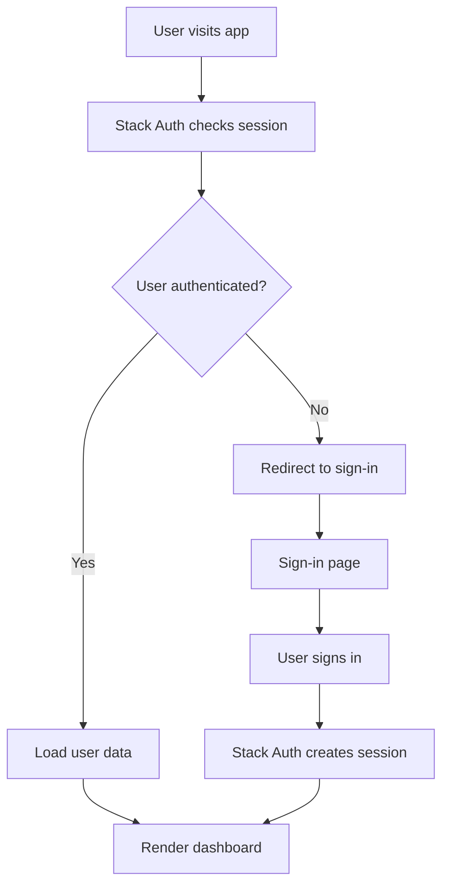
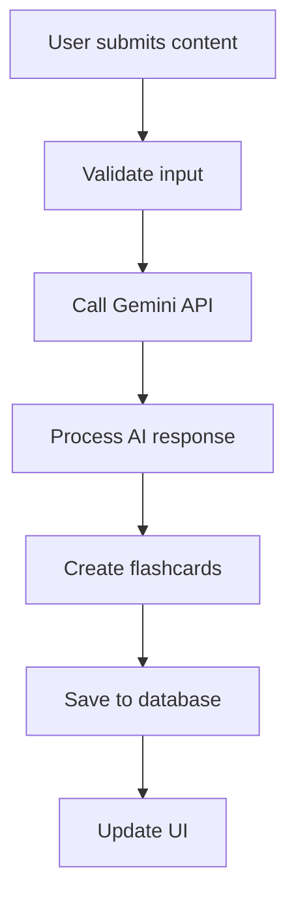
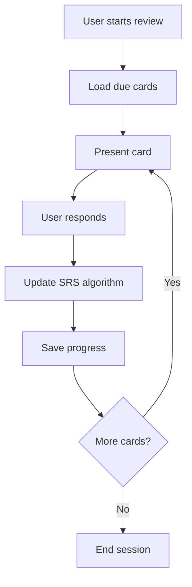

---
layout:
  width: wide
  title:
    visible: true
  description:
    visible: true
  tableOfContents:
    visible: true
  outline:
    visible: true
  pagination:
    visible: true
  metadata:
    visible: true
---

# Project Architecture

Understand Anzii's technical architecture, tech stack, and project structure.

## 🏗️ Tech Stack

### Frontend

* **Next.js 15** - React framework with App Router
* **React 18** - UI library with concurrent features
* **TypeScript** - Type-safe JavaScript
* **Tailwind CSS** - Utility-first CSS framework
* **Radix UI** - Accessible component primitives

### Backend & Database

* **PostgreSQL** - Primary database
* **Drizzle ORM** - Type-safe database operations
* **Next.js API Routes** - Server-side API endpoints

### AI & Services

* **Google Gemini API** - AI content generation
* **Stack Auth** - Authentication (replacing NextAuth.js)
* **Vercel Analytics** - Performance monitoring

### State Management

* **TanStack Query (React Query)** - Server state management
* **Zustand** - Client state management
* **React Hook Form** - Form state management

### Testing & Quality

* **Jest** - Unit testing framework
* **React Testing Library** - Component testing
* **Playwright** - End-to-end testing
* **ESLint** - Code linting
* **Prettier** - Code formatting

### Build & Deployment

* **Turbopack** - Fast bundler (development)
* **Webpack** - Production bundler
* **Vercel** - Deployment platform

## 📁 Project Structure

```
anzii/
├── src/
│   ├── app/                    # Next.js App Router
│   │   ├── (auth)/            # Authentication pages
│   │   ├── api/               # API routes
│   │   ├── dashboard/         # Dashboard pages
│   │   ├── deck/              # Deck management
│   │   ├── review/            # Study sessions
│   │   └── layout.tsx         # Root layout
│   │
│   ├── components/            # Reusable components
│   │   ├── ui/               # Base UI components
│   │   ├── features/         # Feature-specific components
│   │   ├── layout/           # Layout components
│   │   └── sections/         # Page sections
│   │
│   ├── db/                   # Database layer
│   │   ├── schema.ts         # Database schema
│   │   ├── index.ts          # Database connection
│   │   └── migrate.ts        # Migration runner
│   │
│   ├── ai/                   # AI integration
│   │   ├── config.ts         # AI configuration
│   │   └── flows/            # AI processing flows
│   │
│   ├── hooks/                # Custom React hooks
│   ├── lib/                  # Utilities and core logic
│   ├── types/                # TypeScript definitions
│   └── stack.tsx             # Stack Auth configuration
│
├── drizzle/                  # Database migrations
├── tests/                    # Test files
├── docs/                     # Documentation
└── public/                   # Static assets
```

## 🎯 Key Architectural Decisions

### 1. App Router Architecture

**Benefits:**

* Server Components by default
* Built-in layouts and routing
* Improved performance with streaming
* Better SEO with server-side rendering

**Structure:**

```tsx
// app/layout.tsx - Root layout
export default function RootLayout({ children }) {
	return (
		<html>
			<body>
				<Providers>{children}</Providers>
			</body>
		</html>
	);
}
```

### 2. Component Architecture

**UI Components (Radix + Tailwind)**

```tsx
// components/ui/button.tsx
import { cva } from "class-variance-authority";

const buttonVariants = cva(
	"inline-flex items-center justify-center rounded-md text-sm font-medium",
	{
		variants: {
			variant: {
				default: "bg-primary text-primary-foreground hover:bg-primary/90",
				destructive:
					"bg-destructive text-destructive-foreground hover:bg-destructive/90",
			},
			size: {
				default: "h-10 px-4 py-2",
				sm: "h-9 rounded-md px-3",
				lg: "h-11 rounded-md px-8",
			},
		},
		defaultVariants: {
			variant: "default",
			size: "default",
		},
	}
);
```

**Feature Components**

```tsx
// components/features/deck/deck-card.tsx
export function DeckCard({ deck }: { deck: Deck }) {
	return (
		<Card>
			<CardHeader>
				<CardTitle>{deck.name}</CardTitle>
				<CardDescription>{deck.description}</CardDescription>
			</CardHeader>
			<CardContent>{/* Deck-specific content */}</CardContent>
		</Card>
	);
}
```

### 3. State Management Strategy

**Server State (TanStack Query)**

```tsx
// hooks/use-decks.ts
export function useDecks() {
	return useQuery({
		queryKey: ["decks"],
		queryFn: getDecks,
		staleTime: 5 * 60 * 1000, // 5 minutes
	});
}
```

**Client State (Zustand)**

```tsx
// lib/stores/settings-store.ts
interface SettingsStore {
	theme: string;
	setTheme: (theme: string) => void;
}

export const useSettingsStore = create<SettingsStore>((set) => ({
	theme: "default",
	setTheme: (theme) => set({ theme }),
}));
```

### 4. Database Architecture

**Schema Definition**

```tsx
// db/schema.ts
export const users = pgTable("users", {
	id: uuid("id").primaryKey().defaultRandom(),
	email: varchar("email", { length: 255 }).notNull().unique(),
	displayName: varchar("display_name", { length: 255 }),
	createdAt: timestamp("created_at").defaultNow(),
	updatedAt: timestamp("updated_at").defaultNow(),
});
```

**Type-Safe Queries**

```tsx
// lib/actions.ts
export async function getDecks(userId: string) {
	return await db
		.select()
		.from(decks)
		.where(eq(decks.userId, userId))
		.orderBy(desc(decks.createdAt));
}
```

## 🔄 Data Flow

### 1. User Authentication Flow



### 2. AI Content Generation Flow



### 3. Study Session Flow



## 🎨 Design System

### Theme System

**Color Schemes**

```tsx
// lib/colors.ts
export const colorSchemes = {
	default: {
		background: "hsl(0 0% 100%)",
		foreground: "hsl(222.2 84% 4.9%)",
		primary: "hsl(222.2 47.4% 11.2%)",
		// ... more colors
	},
	// 16 more themes
};
```

**Component Variants**

```tsx
// Using class-variance-authority for variants
const cardVariants = cva(
	"rounded-lg border bg-card text-card-foreground shadow-sm",
	{
		variants: {
			variant: {
				default: "border-border",
				elevated: "shadow-lg",
				outline: "border-2",
			},
		},
		defaultVariants: {
			variant: "default",
		},
	}
);
```

## 🔧 Performance Optimizations

### 1. Code Splitting

```tsx
// Lazy load components
const LazyDeckEditor = lazy(() => import("./deck-editor"));

// Route-based splitting
const Dashboard = lazy(() => import("./dashboard"));
```

### 2. Image Optimization

```tsx
// Next.js Image component
import Image from "next/image";

<Image src="/logo.png" alt="Anzii Logo" width={100} height={100} priority />;
```

### 3. Caching Strategy

```tsx
// React Query caching
const queryClient = new QueryClient({
	defaultOptions: {
		queries: {
			staleTime: 5 * 60 * 1000, // 5 minutes
			cacheTime: 10 * 60 * 1000, // 10 minutes
		},
	},
});
```

## 🧪 Testing Strategy

### 1. Unit Tests (Jest)

```tsx
// __tests__/components/deck-card.test.tsx
import { render, screen } from "@testing-library/react";
import { DeckCard } from "@/components/features/deck/deck-card";

test("renders deck information", () => {
	const deck = { name: "Test Deck", description: "Test Description" };
	render(<DeckCard deck={deck} />);

	expect(screen.getByText("Test Deck")).toBeInTheDocument();
	expect(screen.getByText("Test Description")).toBeInTheDocument();
});
```

### 2. E2E Tests (Playwright)

```tsx
// tests/e2e/deck-creation.spec.ts
import { test, expect } from "@playwright/test";

test("user can create a new deck", async ({ page }) => {
	await page.goto("/create");
	await page.fill('[data-testid="deck-name"]', "My New Deck");
	await page.click('[data-testid="create-deck"]');

	await expect(page).toHaveURL(/\/deck\/.+/);
	await expect(page.locator("h1")).toContainText("My New Deck");
});
```

## 📚 Related Documentation

* [**Quick Start**](../setup-and-installation/quick-start.md) - Get up and running quickly
* [**Development Workflow**](development-workflow.md) - Development practices
* [**UI Development**](ui-development.md) - Building with the design system
* [**AI Integration**](../advanced-features/ai-integration.md) - Working with AI features
* [**State Management**](../advanced-features/state-management.md) - State management patterns

***

**Ready to start developing?** Check out the [Development Workflow](development-workflow.md) to learn about scripts, testing, and best practices!
